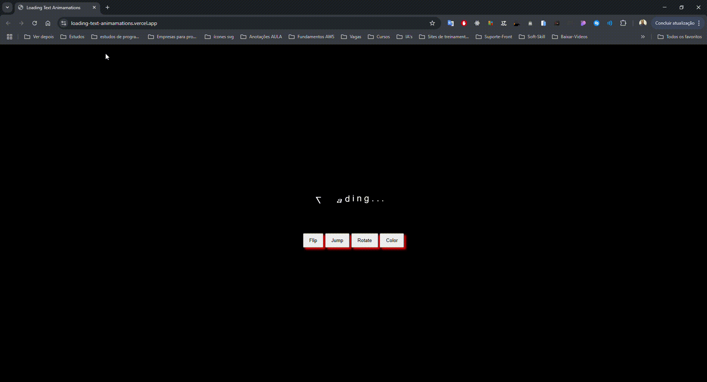

# Loading Text Animations 🚀

Bem-vindo ao projeto **Loading Text Animations**! Este projeto é uma demonstração interativa e estilosa de animações aplicadas em textos para criar carregamentos dinâmicos e visuais. 🌟

🌐 **Deploy do Projeto:** Em [Vercel](https://loading-text-animamations.vercel.app/) ou [Netlify](https://loading-text-animamations.netlify.app/)

---

## 🗂 Estrutura do Projeto

A organização dos arquivos está bem definida para facilitar o entendimento e a manutenção:

```
/ (raiz do projeto)
├── .gitignore
├── LICENSE.txt
├── README.md
├── index.html          # Estrutura HTML principal do projeto
├── script.js           # Código JavaScript para interatividade
├── style.css           # Estilos gerados pelo Sass
├── style.css.map       # Mapa de origem para depuração do CSS
├── style.scss          # Arquivo Sass para estilos modulares
├── assets/             # Recursos do projeto
    └── Loading-Text-Animamations.gif # Screenshot da aplicação
```

---

## 🎯 Funcionalidade

Este projeto exibe um texto animado que reage a botões interativos, permitindo que o usuário aplique diferentes animações como:

- **Flip:** O texto realiza uma rotação em torno do eixo X.
- **Jump:** O texto realiza pequenos saltos verticais.
- **Rotate:** O texto gira em torno do eixo central.
- **Color:** O texto muda gradualmente de cor.

A combinação dessas animações cria uma experiência visual envolvente e divertida. 💫

---

## 🌟 Interatividade

As animações são acionadas ao clicar nos botões abaixo do texto. Isso foi implementado utilizando **JavaScript** com a biblioteca **jQuery** para simplificar as interações DOM. Veja um exemplo de código:

```javascript
$(".flip").click(() => {
    $(".loading>div").css({
        "animation-name": "flip",
        "transform-origin": "50% 50% 8px"
    });
});

$(".jump").click(() => {
    $(".loading>div").css("animation-name", "jump");
});
```

---

## 🎨 Organização e Semântica

- **HTML:**
  - Uso de tags semânticas como `<main>` e `<section>` para estruturar o conteúdo de forma acessível.
  - Hierarquia bem definida para fácil navegação.

- **CSS/Sass:**
  - Estilos modulares escritos em **Sass**, gerando um CSS otimizado.
  - Variáveis CSS para manter consistência de cores e facilitar manutenção.
  
    ```scss
    :root {
        --primary-color-black: #000000;
        --primary-color-white: #ffffff;
        --secondary-color-white: #dfdddd;
        --primary-color-red: #ff0000;
    }
    ```

---

## 🛠️ Habilidades Técnicas Demonstradas

- **HTML5:** Estrutura semântica e acessível.
- **CSS3:** Animações com `@keyframes` e uso de variáveis.
- **Sass:** Modularização e escalabilidade dos estilos.
- **JavaScript (ES6):** Manipulação de DOM.
- **jQuery:** Simplificação de eventos e estilos dinâmicos.
- **Vercel / Netlify:** Deploy rápido e eficiente.

---

## 🛠️ Tecnologias Utilizadas

- **HTML5**
- **CSS3/Sass**
- **JavaScript**
- **jQuery**
- **Vercel**
- **Netlify**

---

## ▶️ Como Rodar o Projeto

1. **Clone o repositório:**
   ```bash
   git clone https://github.com/Eduardo377/loading-text-animamations.git
   ```

2. **Acesse o diretório:**
   ```bash
   cd loading-text-animamations
   ```

3. **Instale o Sass (se necessário):**
   ```bash
   npm install -g sass
   ```

4. **Compile o Sass:**
   ```bash
   sass --watch style.scss:style.css
   ```

5. **Abra o arquivo `index.html` no navegador:**
   ```bash
   start index.html
   ```

---

## ✨ Destaques do Projeto

- **Animações Dinâmicas:** Criadas usando `@keyframes`.
- **Design Responsivo:** Compatível com diferentes dispositivos.
- **Interatividade:** Botões que alteram o comportamento do texto de forma fluida.
- **Modularidade:** Uso de Sass para melhor organização de estilos.

---

## 🎥 Demonstrações

<div>
    
</div>

---

## 📞 Contato

<div>
    
    <p>&nbsp&nbsp&nbsp Eduardo A.<br>
    &nbsp;<a href="https://github.com/Eduardo377">GitHub</a>&nbsp;|&nbsp;<a href="https://www.linkedin.com/in/eduardogomes377/">LinkedIn</a>&nbsp;</p>
    <p><a href="https://wa.me/5521982646297">(21) 9 8264-6297</a></p>
    <p><a href="mailto:eduardogomes377@gmail.com">eduardogomes377@gmail.com</a></p>
</div>


## Licença 📜

Este projeto está licenciado sob a [MIT License](LICENSE.txt). 🏆